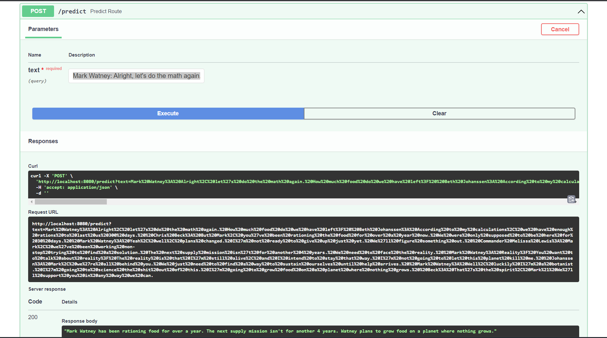

# End to end Text-Summarizer-NLP

## Introduction 

This repository contains an end-to-end Natural Language Processing (NLP) project that focuses on text summarization. The project includes data processing, modeling, and a prediction pipeline, providing a comprehensive solution for summarizing text content.

## Overview

The goal of this project is to develop a text summarization tool using Google Pegasus-XSUM, a state-of-the-art NLP model. The tool automates the process of condensing lengthy text documents into concise summaries, saving time and effort for readers. With the implementation of Continuous Integration and Continuous Deployment (CI/CD) using GitHub Actions, the text summarizer is efficiently deployed on Amazon EC2, ensuring seamless accessibility.

## Key Features
- End-to-end NLP project for text summarization
- Utilizes Google Pegasus-XSUM for generating summaries
- Streamlined data processing, modeling, and prediction pipeline
- Implements CI/CD deployment with GitHub Actions
- Deployed on Amazon EC2 for efficient access and usage

## Workflows

1. Update config.yaml
2. Update params.yaml
3. Update entity
4. Update the configuration manager in src config
5. update the conponents
6. update the pipeline
7. update the main.py
8. update the app.py

# AWS-CICD-Deployment-with-Github-Actions

## 1. Login to AWS console.

## 2. Create IAM user for deployment

	#with specific access

	1. EC2 access : It is virtual machine

	2. ECR: Elastic Container registry to save your docker image in aws

	#Description: About the deployment

	1. Build docker image of the source code

	2. Push your docker image to ECR

	3. Launch Your EC2 

	4. Pull Your image from ECR in EC2

	5. Lauch your docker image in EC2

	#Policy:

	1. AmazonEC2ContainerRegistryFullAccess

	2. AmazonEC2FullAccess

	
## 3. Create ECR repo to store/save docker image
	
## 4. Create EC2 machine (Ubuntu) 

## 5. Open EC2 and Install docker in EC2 Machine:
	
	
	#optinal

	sudo apt-get update -y

	sudo apt-get upgrade
	
	#required

	curl -fsSL https://get.docker.com -o get-docker.sh

	sudo sh get-docker.sh

	sudo usermod -aG docker ubuntu

	newgrp docker
	
## 6. Configure EC2 as self-hosted runner:
    setting>actions>runner>new self hosted runner> choose os> then run command one by one

## 7. Setup github secrets:

# Screenshot

## 1. Predict API

	input string:
		"Mark Watney: Alright, let's do the math again. How much food do we have left?
		Beth Johanssen: According to my calculations, we have enough rations to last us 300 days.  
		Chris Beck: But Mark, you've been rationing the food for over a year now. We were only supposed to be here for 30 days.  
		Mark Watney: Yeah, well, plans changed. I'm not ready to give up just yet. We'll figure something out.  
		Commander Melissa Lewis: Mark, we've been working non-stop trying to find a solution. The next supply mission isn't for another 4 years. We need to face the reality.  
		Mark Watney: Reality? You want to talk about reality? The reality is that I'm still alive, and I intend to stay that way. I'm not going to let this planet kill me.  
		Johanssen: Mark, we're all behind you. We just need to find a way to sustain ourselves until help arrives.  
		Mark Watney: Well, luckily I'm a botanist. I'm going to science the shit out of this. I'm going to grow food on a planet where nothing grows.  
		Beck: That's the spirit, Mark! We'll support you in any way we can."

	output string:
		"Mark Watney has been rationing food for over a year. The next supply mission isn't for another 4 years. Watney plans to grow food on a planet where nothing grows."

		
